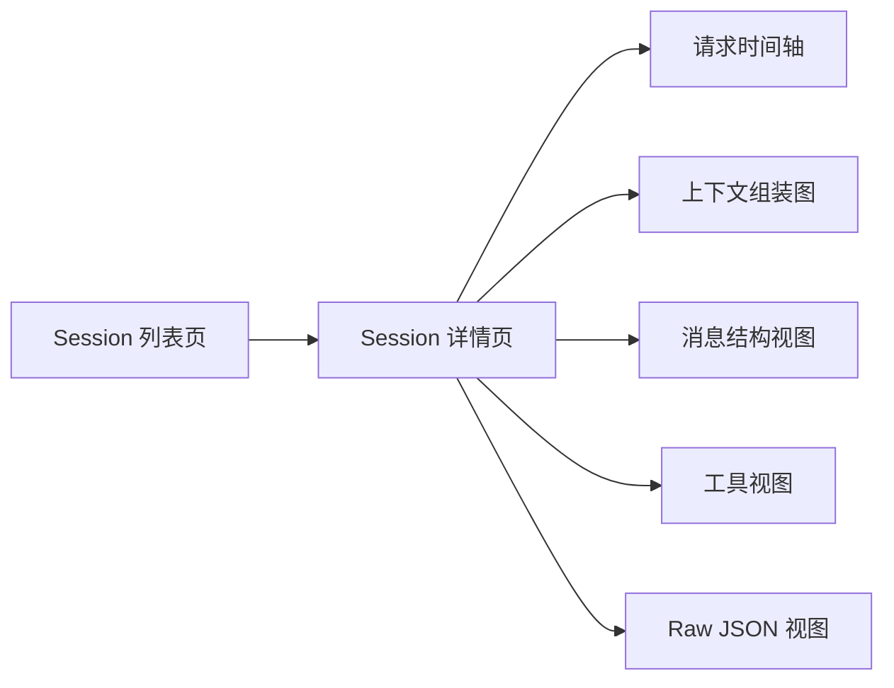
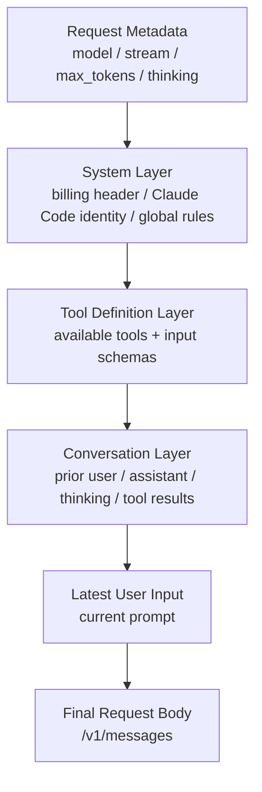

# prompt-gateway PRD

## 1. 产品概述

`prompt-gateway` 是一个面向 Claude Code CLI 请求分析的 Web 工具，帮助用户理解 Claude Code 在编码过程中如何组装一次发往模型的请求上下文，包括系统提示、会话历史、工具定义、工具调用、上下文管理策略和最终用户输入。

本 PRD 只关注 Web 端展示方案，不涉及数据采集、数据存储、接口设计、鉴权、部署与前后端交互实现。

## 2. 背景与问题

Claude Code CLI 在用户输入一句话后，实际发送给模型的请求通常包含大量隐藏上下文。用户很难直观看到：

- Claude Code 在 `system` 中注入了哪些规则和运行环境信息。
- 用户输入、历史对话、assistant 回复、thinking、tool_use、tool_result 如何组成 `messages`。
- 当前请求暴露了哪些工具，工具 schema 有多大，工具说明对上下文占用有什么影响。
- `context_management`、`cache_control`、`thinking`、`metadata` 等字段如何影响请求。
- 同一个 session 中，多次请求之间上下文发生了哪些变化。

`prompt-gateway` 的目标不是替代日志查看器，而是把一次请求的 prompt 组装过程可视化，让用户能像看构建产物一样看清“Claude Code 最终把什么发给了模型”。

## 3. 产品目标

### 3.1 核心目标

- 让用户在 session 级别快速定位一次或一组请求。
- 让用户在 request 级别看清 Claude Code 的上下文组装结构。
- 让用户能比较同一 session 中相邻请求的上下文变化。
- 让用户能分辨“用户真正输入的内容”和“Claude Code 自动注入的内容”。
- 让工具定义、工具调用、工具结果在页面上独立成区，避免混在长 JSON 里难以阅读。

### 3.2 非目标

- 不做请求数据来源设计。
- 不做后端接口设计。
- 不做权限、登录、团队协作设计。
- 不做 prompt 优化建议或自动评分。
- 不做 Claude Code 行为的因果推断，只展示从请求数据中可以直接或合理派生的信息。

## 4. 目标用户

- 正在研究 Claude Code CLI 工作机制的开发者。
- 想排查“为什么 Claude Code 这样回答/这样调用工具”的高级用户。
- 想观察上下文膨胀、工具 schema 占用、历史消息变化的工程团队。
- 想给团队讲解 Claude Code prompt 结构的技术负责人。

## 5. 数据理解

单条请求数据中，`requestBody.raw` 代表一次真实发送给 Claude Code / Anthropic Messages API 的请求体。基于当前样例，前端至少需要识别以下结构：

```json
{
  "model": "claude-sonnet-4-6",
  "max_tokens": 32000,
  "stream": true,
  "thinking": { "type": "adaptive" },
  "context_management": {
    "edits": [{ "type": "clear_thinking_20251015", "keep": "all" }]
  },
  "system": [],
  "messages": [],
  "tools": [],
  "metadata": {}
}
```

### 5.1 前端展示字段映射

| 字段 | 展示含义 | 推荐展示方式 |
| --- | --- | --- |
| `sessionId` | 所属会话 | session 标题、列表主键 |
| `requestId` | 单次请求 ID | 请求详情标题、复制入口 |
| `capturedAt` / `timestampMs` | 捕获时间 | 时间轴、排序、相邻请求比较 |
| `method` / `path` | API 请求目标 | 请求元信息 |
| `requestBody.raw.model` | 模型 | 概览 badge |
| `requestBody.raw.max_tokens` | 最大输出 token | 概览指标 |
| `requestBody.raw.stream` | 是否流式 | 概览开关态 |
| `requestBody.raw.thinking` | thinking 模式 | 独立配置块 |
| `requestBody.raw.context_management` | 上下文管理策略 | 独立配置块，高亮 edits |
| `requestBody.raw.system` | 系统提示层 | 上下文组装图第一层 |
| `requestBody.raw.messages` | 会话消息层 | 对话时间线、内容类型拆分 |
| `requestBody.raw.tools` | 可用工具定义 | 工具目录、schema 折叠面板 |
| `cache_control` | 缓存提示 | 在对应 system/message/tool 块上显示缓存标记 |
| `metadata` | 请求元数据 | 可折叠详情 |

## 6. 信息架构

产品仅包含两个 Web 页面：

1. Session 列表页：浏览、筛选、定位 session。
2. Session 详情页：查看一个 session 内所有请求，并分析单次请求的上下文组装。



## 7. 页面一：Session 列表页

### 7.1 页面目标

帮助用户从大量 session 中快速找到要分析的会话，并在进入详情前建立基本判断：这个 session 有多少请求、跨度多久、用了哪些模型、工具与上下文是否复杂。

### 7.2 页面布局

页面采用工作台式布局，而不是营销页或大卡片首页：

- 顶部：产品名、全局搜索、时间范围筛选。
- 左侧可选过滤区：模型、日期、请求数量区间、是否有工具调用、是否有 context management。
- 主区域：session 表格。
- 右侧可选预览抽屉：选中 session 后展示摘要。

### 7.3 Session 表格字段

| 列 | 说明 |
| --- | --- |
| Session | 显示短 sessionId、首条用户输入摘要 |
| Time Range | session 开始和结束时间 |
| Requests | 请求总数 |
| Models | session 内出现过的模型 |
| Context Size | 最近一次或最大一次请求的上下文估算大小 |
| Tools | 出现过的工具数量，标记是否有工具调用 |
| Changes | 最近请求的变化摘要，例如 system 变化、tools 变化、messages 增长 |
| Last Prompt | 最后一条用户输入预览 |

### 7.4 搜索与筛选

需要支持以下前端交互：

- 按 sessionId、requestId、用户输入文本、工具名搜索。
- 按时间范围筛选。
- 按模型筛选。
- 按是否包含工具调用筛选。
- 按上下文规模排序。
- 按请求数量排序。
- 按最近更新时间排序。

### 7.5 Session 摘要预览

用户点击表格行但不进入详情时，右侧抽屉展示：

- sessionId 与时间范围。
- 请求数量、工具数量、模型列表。
- 首次用户输入与最后一次用户输入。
- 请求上下文增长趋势小图。
- 最近 5 次请求列表。
- “查看详情”按钮。

### 7.6 空状态与异常状态

- 无 session：展示“暂无捕获的 session”，不解释后端采集方式。
- 搜索无结果：保留筛选条件并提示清空筛选。
- 数据字段缺失：对应列展示 `Unknown`，不阻塞进入详情。

## 8. 页面二：Session 详情页

### 8.1 页面目标

让用户围绕一个 session 逐次查看请求，并在单次请求中直观看到 Claude Code 如何将上下文组装为最终请求。

### 8.2 页面整体布局

推荐三栏布局：

- 左栏：请求时间轴。
- 中栏：当前请求的上下文组装主视图。
- 右栏：检查器面板，用于查看选中块的完整内容、schema 或 JSON。

页面顶部固定 session 概览条：

- 返回列表按钮。
- sessionId。
- 请求数量。
- 时间范围。
- 当前选中请求序号，例如 `Request 12 / 48`。
- 模型、max tokens、stream、thinking 状态。

### 8.3 左栏：请求时间轴

每个请求节点展示：

- 请求序号。
- 捕获时间。
- 用户输入摘要。
- 模型。
- system/message/tool 数量。
- 上下文估算大小。
- 与上一请求相比的变化 badge：
  - `+ user message`
  - `+ assistant thinking`
  - `tools changed`
  - `system changed`
  - `context edit`
  - `cache hint`

时间轴支持：

- 点击切换请求。
- 上下键切换请求。
- 只看有工具调用的请求。
- 只看上下文发生显著变化的请求。
- 与上一请求 diff。

### 8.4 中栏：请求概览

选中请求后，顶部先展示一行请求概览：

| 模块 | 内容 |
| --- | --- |
| API | `POST /v1/messages` |
| Model | `requestBody.raw.model` |
| Max Tokens | `requestBody.raw.max_tokens` |
| Stream | `requestBody.raw.stream` |
| Thinking | `requestBody.raw.thinking.type` |
| Context Management | `requestBody.raw.context_management.edits` |
| Tools | `requestBody.raw.tools.length` |
| Messages | `requestBody.raw.messages.length` |
| System Blocks | `requestBody.raw.system.length` |

### 8.5 中栏核心：上下文组装图

这是整个产品最重要的模块。它需要把 `requestBody.raw` 里的内容按“最终进入请求的层级”可视化，而不是只显示 JSON。

推荐展示为纵向 Context Stack：



每一层都是可展开的结构块：

| 层 | 来源字段 | 展示重点 |
| --- | --- | --- |
| Request Metadata | `model`, `max_tokens`, `stream`, `thinking`, `metadata` | 说明这次请求的运行配置 |
| Context Management | `context_management` | 展示上下文裁剪、thinking 清理等策略 |
| System Layer | `system[]` | 按 block 展示系统提示，标记注入来源和 cache_control |
| Tool Definition Layer | `tools[]` | 工具名、说明长度、schema 字段、是否变化 |
| Conversation Layer | `messages[]` | 历史消息、assistant thinking、tool_use、tool_result |
| Latest User Input | `messages` 中最后一条 user 文本 | 高亮用户真正输入 |

### 8.6 上下文块的视觉规则

每个上下文块需要显示：

- 类型：system、user、assistant、thinking、tool_use、tool_result、tool schema。
- 序号：例如 `system[2]`、`messages[1].content[0]`。
- 内容摘要。
- 字符数或 token 估算。
- 是否带 `cache_control`。
- 是否相对上一请求新增、删除或变化。
- 点击后在右侧检查器展示完整内容。

建议颜色只作为辅助，不依赖颜色表达唯一信息：

- System：中性色。
- User：高亮主色。
- Assistant：次级色。
- Thinking：虚线边框或特殊图标。
- Tool Definition：工具图标。
- Tool Result：结果图标。
- Cache：独立 badge。
- Context Edit：警示 badge。

### 8.7 消息结构视图

在上下文组装图下方，提供 `messages` 的对话式视图，帮助用户理解会话历史如何进入请求。

每条 message 显示：

- `role`：user / assistant。
- content 数量。
- content 类型序列，例如 `text + thinking + tool_use`。
- 主要文本预览。
- 是否是当前用户输入。

content 需要按类型拆开：

- `text`：展示文本内容，支持折叠。
- `thinking`：默认折叠，显示长度、signature 是否存在。
- `tool_use`：展示工具名、调用参数摘要。
- `tool_result`：展示对应 tool_use id、结果长度、是否错误。

### 8.8 工具视图

工具视图用于回答“Claude Code 这次给模型开放了哪些工具，以及每个工具如何被描述”。

展示两类信息：

1. 工具定义：来自 `requestBody.raw.tools[]`。
2. 工具调用：来自 `messages[].content[]` 中的 `tool_use` 和 `tool_result`。

工具定义表格字段：

| 列 | 说明 |
| --- | --- |
| Tool Name | 工具名，例如 Bash、Read、Edit |
| Description Size | 工具说明长度 |
| Input Fields | schema 中的字段 |
| Required Fields | schema required 字段 |
| Changed | 相比上一请求是否变化 |

工具调用时间线字段：

| 列 | 说明 |
| --- | --- |
| Request Index | 发生在哪次请求上下文中 |
| Tool | 工具名 |
| Input Summary | 参数摘要 |
| Result Summary | 结果摘要 |
| Linked Message | 对应 message/content 位置 |

如果当前请求只有工具定义、没有工具调用，页面需要明确提示：“当前请求暴露了工具定义，但上下文中未出现工具调用记录。”

### 8.9 Diff 视图

为了让用户理解“同一个 session 里上下文如何累积”，详情页必须支持与上一请求对比。

Diff 维度：

- System diff：system block 是否变化。
- Messages diff：新增了哪些 user/assistant/tool_result。
- Tools diff：工具数量、工具说明、schema 是否变化。
- Metadata diff：session_id、user_id 等字段是否变化。
- Context management diff：是否出现新的 edit。

展示方式：

- 在请求时间轴上显示变化 badge。
- 在上下文组装图中给变化块加 `Added`、`Changed`、`Removed` 标记。
- 右侧检查器提供结构化 diff，不默认展示整段 JSON diff。

### 8.10 右栏：检查器面板

用户点击任何上下文块、工具、message、metadata 后，右侧检查器展示完整详情：

- Path：例如 `requestBody.raw.system[2].text`。
- Type：字段类型。
- Size：字符数 / token 估算。
- Cache：是否存在 `cache_control`。
- Content：完整文本或格式化 JSON。
- Copy：复制当前字段内容。
- Open in Raw：跳转到 Raw JSON 对应位置。

右栏默认展示当前请求的字段目录：

- Metadata
- Context Management
- System
- Messages
- Tools
- Raw JSON

### 8.11 Raw JSON 视图

Raw JSON 不是主视图，但必须保留，满足高级用户核对数据。

能力要求：

- JSON 格式化展示。
- 支持字段路径定位。
- 支持搜索字段和值。
- 点击上下文组装图中的块，可以定位到 Raw JSON 对应路径。
- 支持复制完整 request body。

## 9. 关键体验设计

### 9.1 用户输入必须被高亮

页面需要始终帮助用户分辨：

- 用户在 CLI 中真正输入了什么。
- Claude Code 在请求中额外加入了什么。

在详情页中，最新用户输入应该有独立高亮区，并标记来源为：

`messages[last].role = user`

如果 user message 中包含 `<system-reminder>` 这类自动注入内容，需要拆分或标记为“系统提醒内容”，避免用户误以为这些都是手动输入。

### 9.2 系统提示需要按 block 展示

不能把 `system` 合成一个大文本框。应该保留 block 序号、cache 状态和长度信息。例如：

- `system[0]`：billing / client metadata。
- `system[1]`：Claude Code identity。
- `system[2]`：主要运行规则与环境说明。

### 9.3 工具定义需要独立计算体积

工具 schema 往往很长，容易解释上下文为什么变大。因此工具视图需要显示：

- 工具总数。
- 每个工具说明长度。
- schema 字段数量。
- 最大的几个工具定义。
- 与上一请求相比是否变化。

### 9.4 Thinking 默认折叠但可检查

如果 messages 中存在 `thinking` content：

- 在消息视图中显示 thinking 块。
- 默认折叠正文。
- 展示 thinking 长度。
- 如存在 signature，仅展示存在状态与长度，不在主视图铺开。

### 9.5 上下文管理策略需要显眼

`context_management` 直接影响用户理解上下文如何被处理，不能放在 metadata 里弱化。需要在请求概览和 Context Stack 中都有入口。

例如样例中的：

```json
{
  "edits": [
    { "type": "clear_thinking_20251015", "keep": "all" }
  ]
}
```

应该展示为：

`Context Management: clear thinking, keep all`

## 10. 推荐交互流程

### 10.1 查看一个 session 的上下文组装

1. 用户进入 Session 列表页。
2. 搜索或筛选目标 session。
3. 点击 session 进入详情页。
4. 左侧默认选中最后一次请求。
5. 中栏显示 Context Stack。
6. 用户点击 `Latest User Input`，确认自己输入的内容。
7. 用户点击 `System Layer`，查看 Claude Code 注入的系统规则。
8. 用户点击 `Tool Definition Layer`，查看本次请求暴露的工具。
9. 用户开启 `Compare with previous`，查看上下文变化。

### 10.2 排查上下文膨胀

1. 在 Session 详情页按上下文大小排序请求。
2. 选中最大的一次请求。
3. 查看 Context Stack 中各层大小占比。
4. 打开工具视图，查看最大工具定义。
5. 打开消息结构视图，查看历史消息增长。
6. 使用 diff 判断是哪次请求开始显著变大。

## 11. 展示指标

前端可基于已有 JSON 派生以下展示指标：

| 指标 | 说明 |
| --- | --- |
| Request Count | session 内请求数量 |
| System Block Count | `system.length` |
| Message Count | `messages.length` |
| Tool Count | `tools.length` |
| Content Type Count | text / thinking / tool_use / tool_result 数量 |
| Estimated Context Size | system + messages + tools 的字符数或 token 估算 |
| Largest Layer | 当前请求中占比最大的层 |
| Diff Size | 与上一请求相比新增/变化内容规模 |
| Cache Block Count | 带 `cache_control` 的 block 数量 |

Token 估算可以先用近似值展示，并在 UI 上标记为 `estimated`，避免让用户误解为精确 API token 计数。

## 12. 可用性要求

- 长文本默认折叠，避免页面被 system prompt 或 tool description 淹没。
- 所有 block 都必须能展开、复制、定位到 raw path。
- 大 session 下请求时间轴需要支持虚拟滚动。
- 表格列支持排序。
- 详情页刷新后应能保持当前 session 和 request 选择。
- 所有 ID 默认短显，hover 或点击后可复制完整值。
- JSON 展示需要等宽字体；普通说明和表格使用常规 UI 字体。

## 13. 验收标准

### 13.1 Session 列表页

- 用户可以看到所有 session 的列表。
- 用户可以通过 sessionId、requestId、用户输入、工具名搜索 session。
- 用户可以根据时间、模型、请求数量、上下文大小排序或筛选。
- 用户可以进入某个 session 的详情页。
- 列表页能展示 session 的请求数量、时间范围、模型和最后用户输入。

### 13.2 Session 详情页

- 用户可以在左侧看到 session 内的请求时间轴。
- 用户可以切换不同请求。
- 用户可以看到当前请求的 model、max tokens、stream、thinking、context management。
- 用户可以通过 Context Stack 看出请求由 metadata、system、tools、messages、latest user input 组成。
- 用户可以展开 system block，并看到 block 序号、长度、cache_control。
- 用户可以查看 messages，并区分 user、assistant、thinking、tool_use、tool_result。
- 用户可以查看工具定义列表，包括工具名、说明长度、schema 字段。
- 用户可以对比当前请求和上一请求的上下文变化。
- 用户可以打开 Raw JSON，并从可视化块定位到对应 JSON path。

## 14. 首版优先级

### P0

- Session 列表页。
- Session 详情页三栏布局。
- 请求时间轴。
- Context Stack。
- system/messages/tools 基础展示。
- Raw JSON 查看。
- 与上一请求的基础 diff。

### P1

- 上下文大小占比图。
- 工具调用时间线。
- 高级搜索与字段路径定位。
- cache_control 专门视图。
- thinking 结构化展示。

### P2

- session 级上下文增长趋势。
- 多请求对比。
- 导出分析报告。
- 可分享的只读详情链接。
- prompt 组成教学模式。

## 15. 页面文案原则

- 页面文案应围绕“请求是如何被组装的”表达。
- 避免使用“优化”“好坏评分”等暗示判断的词。
- 对无法精确计算的指标使用 `estimated`。
- 对自动注入内容使用“Injected”、“System Reminder”、“Claude Code Instruction”等明确标识。
- 对用户真实输入使用“User Input”或“Latest User Input”明确标识。

## 16. 样例请求的展示预期

基于当前样例，请求详情页应至少能展示：

- 模型：`claude-sonnet-4-6`
- 最大输出：`32000`
- 流式：`true`
- Thinking：`adaptive`
- Context Management：`clear_thinking_20251015`, `keep: all`
- System blocks：3 个，其中 2 个带 `cache_control: ephemeral`
- Messages：3 条，包含 user、assistant、user
- Tools：28 个
- 最新用户输入：`测试效果32`
- 第一条 user message 中包含 system reminder，应标记为自动注入上下文，而不是普通用户输入

这个样例的核心展示目标是让用户一眼看到：用户最后只输入了一句短文本，但最终请求中同时携带了 Claude Code 的系统规则、环境提醒、历史 assistant thinking、历史对话和 28 个工具定义。
